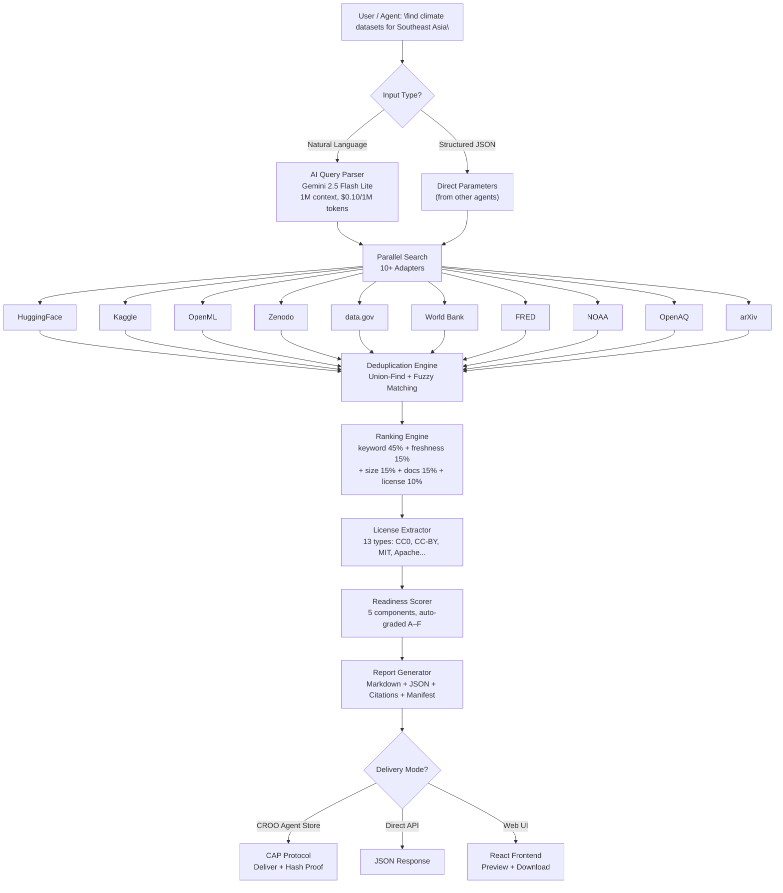
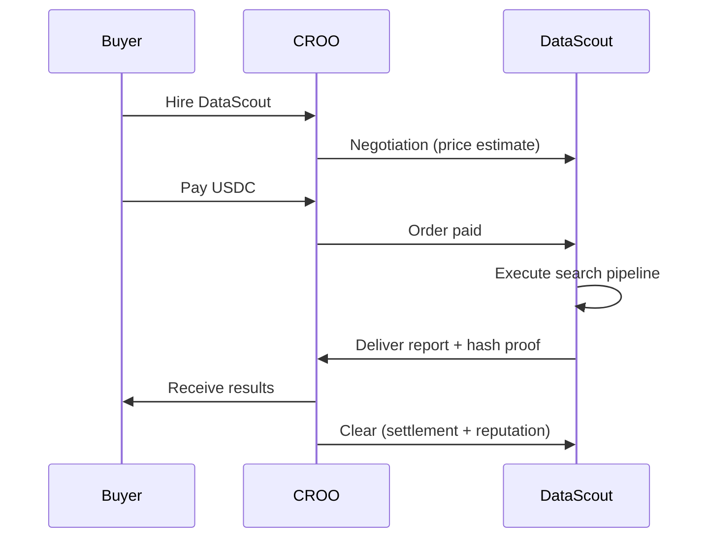

<p align="center">
  <a href="https://github.com/jinggaworld/datascout">
    
  </a>
</p>

<h1 align="center"><b>DataScout</b></h1>

<p align="center">
  <i>Automated Dataset Search, Scoring & Reporting Agent on the CROO Network</i>
</p>

<p align="center">
  
  
  
  
  
</p>

<p align="center">
  <a href="#features">Features</a> &bull;
  <a href="#demo">Demo</a> &bull;
  <a href="#architecture">Architecture</a> &bull;
  <a href="#quick-start">Quick Start</a> &bull;
  <a href="#data-sources">Data Sources</a> &bull;
  <a href="#api-reference">API</a> &bull;
  <a href="#tech-stack">Tech Stack</a>
</p>

---

## Features

<table>
<tr>
<td>

### Multi-Source Search
Parallel search across **10+ dataset sources** simultaneously -- HuggingFace, Kaggle, OpenML, Zenodo, data.gov, World Bank, FRED, NOAA, OpenAQ, arXiv, and more.

</td>
<td>

### AI-Powered Query Understanding
Natural language understanding via **OpenRouter (Gemini 2.5 Flash Lite)** -- 1M context, cost-effective, JSON structured output. Supports Indonesian & English.

</td>
</tr>
<tr>
<td>

### Smart Deduplication
**Union-Find + fuzzy matching** across sources -- merges duplicates, preserves all source links, keeps best metadata.

</td>
<td>

### Readiness Scoring
**5-component weighted score** (completeness, freshness, size, documentation, license) -- auto-graded A through F.

</td>
</tr>
<tr>
<td>

### License Detection
Regex-based classification for **13 license types** -- CC0, CC-BY, CC-BY-NC, MIT, Apache, ODbL, Unlicense, and more.

</td>
<td>

### Reproducible Reports
Full **FinalReport** with ranked datasets, comparison table, APA citations, download manifest, and hash proof.

</td>
</tr>
</table>

---

## Demo

> [](https://youtu.be/vFz-YvFlrpY)

## Architecture



---

## Quick Start

### Prerequisites

- **Python 3.11+**
- **Node.js 18+** (for frontend)
- **OpenRouter API Key** (get at [openrouter.ai/keys](https://openrouter.ai/keys))

### 1. Clone & Setup

```bash
git clone https://github.com/jinggaworld/datascout.git
cd datascout
python -m venv .venv
source .venv/bin/activate  # Windows: .venv\Scripts\activate
```

### 2. Install Dependencies

```bash
# Backend
pip install -r requirements.txt

# Frontend
cd frontend && npm install && cd ..
```

### 3. Configure Environment

```bash
cp .env.example .env
```

Edit `.env` and add your OpenRouter API key:

```env
AI_BACKEND=openrouter
OPENROUTER_API_KEY=sk-or-v1-your_key_here
```

### 4. Run the Server

```bash
python -m src.main
```

> API docs at [http://localhost:8000/docs](http://localhost:8000/docs)

### 5. Run the Frontend

```bash
cd frontend && npm run dev
```

> Frontend at [http://localhost:3000](http://localhost:3000)

---

## Docker

```bash
docker compose up --build
```

---

## Data Sources

| Category | Sources | API Key Required? |
|---|---|---|
| ML / Research | HuggingFace, Kaggle, OpenML | Kaggle only |
| Open Science | Zenodo, arXiv | No |
| Government | data.gov (Socrata) | No |
| International | World Bank, OpenAQ | No |
| Finance / Climate | FRED, NOAA | Yes (free) |

**7 out of 10 sources work without any API key.**

---

## API Reference

### Full Search Pipeline

```http
POST /api/v1/search
```

```json
{
  "query": "housing price dataset in Indonesia for the last 5 years"
}
```

**Response:**
```json
{
  "status": "success",
  "elapsed_ms": 3200,
  "report": { ... },
  "markdown": "# Search Results\n..."
}
```

### Parse Query Only

```http
POST /api/v1/parse
```

```json
{
  "query": "climate change temperature data for Southeast Asia"
}
```

### Structured Input (Agent-to-Agent)

```http
POST /api/v1/search
```

```json
{
  "topic": "housing price",
  "keywords": ["regression", "urban"],
  "region": "ID",
  "min_rows": 10000,
  "license": "commercial_ok",
  "domain": "finance"
}
```

### Health Check

```http
GET /health
```

### All Endpoints

| Method | Path | Description |
|--------|------|-------------|
| `GET` | `/` | API info |
| `GET` | `/health` | Health check |
| `POST` | `/api/v1/parse` | Parse natural language query |
| `POST` | `/api/v1/search` | Full search pipeline |
| `POST` | `/api/v1/cap/negotiate` | CAP price estimation |
| `POST` | `/api/v1/cap/orders` | Create CAP order |
| `GET` | `/api/v1/cap/orders/{id}` | Get order status |
| `POST` | `/api/v1/cap/orders/{id}/deliver` | Submit delivery |
| `POST` | `/api/v1/cap/orders/{id}/clear` | Settle order |

---

## Tech Stack

<table>
<tr>
<td><b>Backend</b></td>
<td>Python 3.11+, FastAPI, Pydantic v2, asyncio</td>
</tr>
<tr>
<td><b>AI Brain</b></td>
<td>OpenRouter -- Gemini 2.5 Flash Lite (1M context, $0.10/1M tokens)</td>
</tr>
<tr>
<td><b>Search</b></td>
<td>httpx async, 10 adapters, parallel execution</td>
</tr>
<tr>
<td><b>Ranking</b></td>
<td>Weighted scoring (keyword, freshness, size, docs, source)</td>
</tr>
<tr>
<td><b>Deduplication</b></td>
<td>Union-Find, SequenceMatcher, URL domain comparison</td>
</tr>
<tr>
<td><b>Profiling</b></td>
<td>pandas, statistics, missing value analysis</td>
</tr>
<tr>
<td><b>Cache</b></td>
<td>SQLite via pydantic-settings</td>
</tr>
<tr>
<td><b>Frontend</b></td>
<td>React 18, TypeScript, Vite, Tailwind CSS</td>
</tr>
<tr>
<td><b>Protocol</b></td>
<td>CROO Agent Protocol (CAP) -- negotiation, lock, deliver, clear</td>
</tr>
</table>

---

## Project Structure

```
datascout/
+-- src/
|   +-- main.py              # FastAPI app + endpoints
|   +-- config.py            # Pydantic settings
|   +-- models/              # Data models (Dataset, Query, License, Report, Score, CAP)
|   +-- adapters/            # 10 search adapters
|   |   +-- huggingface.py   # HuggingFace Datasets Hub
|   |   +-- kaggle.py        # Kaggle
|   |   +-- openml.py        # OpenML
|   |   +-- zenodo.py        # Zenodo
|   |   +-- data_gov.py      # data.gov (Socrata)
|   |   +-- worldbank.py     # World Bank
|   |   +-- fred.py          # FRED (Federal Reserve)
|   |   +-- noaa.py          # NOAA Climate
|   |   +-- openaq.py        # OpenAQ (air quality)
|   |   +-- arxiv.py         # arXiv
|   +-- engine/              # Processing engines
|   |   +-- orchestrator.py  # Parallel search coordinator
|   |   +-- dedup.py         # Deduplication (Union-Find)
|   |   +-- ranking.py       # Relevance ranking
|   |   +-- license.py       # License classification
|   |   +-- profiler.py      # Data profiling
|   |   +-- score.py         # Readiness scoring
|   +-- report/              # Report generation
|   |   +-- generator.py     # FinalReport builder
|   |   +-- citations.py     # APA + BibTeX
|   |   +-- manifest.py      # Download manifest
|   +-- groq/                # AI query parser
|   |   +-- client.py        # Groq/proxy client
|   |   +-- parser.py        # NL -> structured query
|   |   +-- prompts.py       # System prompts
|   +-- cap/                 # CROO Agent Protocol
|       +-- negotiation.py   # Price estimation
|       +-- deliver.py       # Delivery formatting
|       +-- clear.py         # Settlement
+-- frontend/                # React frontend
|   +-- src/
|       +-- App.tsx          # Router
|       +-- api.ts           # API client
|       +-- components/      # UI components
|       +-- pages/           # Route pages
+-- tests/                   # 200+ tests
+-- goals/                   # Project plans
+-- .env.example             # Environment template
+-- requirements.txt         # Python deps
+-- Dockerfile
+-- docker-compose.yml
```

---

## Engine Weights

| Component | Weight | Description |
|-----------|--------|-------------|
| Keyword Match | 45% | Relevance to search query |
| Freshness | 15% | Linear decay over 2 years |
| Size | 15% | Log10 scale up to 100M rows |
| Documentation | 15% | Description, tags, downloads |
| License Clarity | 10% | Commercial-ok > research-only > unknown |

**Grade Scale:** A (>=80) -- B (>=60) -- C (>=40) -- D (>=20) -- F (&lt;20)

---

## CROO Agent Protocol (CAP)

DataScout is a **paid, callable agent** on the CROO Agent Protocol:



---

## Testing

```bash
# Run all tests
.venv/bin/python -m pytest tests/ -v

# Run specific engine tests
.venv/bin/python -m pytest tests/test_engines.py -v

# Run score tests
.venv/bin/python -m pytest tests/test_score.py -v

# Run report tests
.venv/bin/python -m pytest tests/test_report.py -v
```

---

## License

MIT License -- see [LICENSE](LICENSE) for details.

---

<p align="center">
  <i>Built for the CROO Agent Hackathon</i>
</p>
