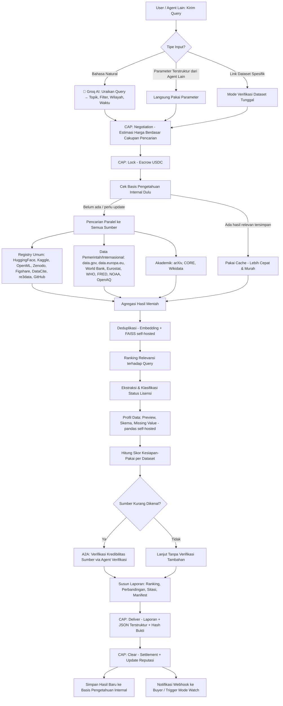

# DataScout — Full Plan
### Agent Pencari, Penilai, dan Penyaji Dataset Otomatis dari Banyak Sumber Terbuka
**CROO Agent Hackathon — Track: Research & Intelligence Agents (cross-track: Developer Tooling / Open-A2A)**

---

## 1. Ringkasan Eksekutif

DataScout adalah agent berbayar (paid, callable) di atas CROO Agent Protocol (CAP) yang menerima permintaan dalam bahasa natural (mis. "cari dataset harga rumah di Indonesia 5 tahun terakhir") lalu secara otomatis **mencari, menyaring, menilai kualitas, mengecek lisensi, dan menyajikan ringkasan siap-pakai** dari puluhan sumber dataset terbuka sekaligus — tanpa buyer perlu membuka satu-satu situs data. Seluruh pencarian memanfaatkan API/registry publik yang gratis, dan setiap dataset yang direkomendasikan disertai skor kesiapan-pakai (readiness score), status lisensi, dan pratinjau data (preview) yang dihasilkan secara lokal (self-hosted, tanpa biaya per-request).

**Value proposition dalam satu kalimat:** "Satu perintah bahasa natural, satu laporan berisi dataset terbaik dari puluhan sumber terbuka — lengkap dengan skor kualitas, status lisensi, dan pratinjau siap pakai."

### 🧠 Otak AI: Groq API (Gratis, Ultra-Fast)

DataScout menggunakan **Groq API** sebagai otak untuk memahami query user dari bahasa natural menjadi parameter terstruktur yang bisa diproses secara programmatic. Groq dipilih karena:

- **Gratis** — Developer Tier tanpa kartu kredit, rate limit cukup untuk production
- **Ultra-fast** — Inference di LPU (Language Processing Unit), response dalam hitungan milidetik
- **OpenAI-compatible** — SDK Python `groq` yang familiar, drop-in replacement
- **JSON Mode & Structured Outputs** — Forced JSON output dengan JSON schema validation
- **Model tersedia** — Llama 3.3 70B, Llama 3.1 8B, Mixtral 8x7b, Qwen, dll

**Alur Query Understanding:**
```
User Query (bahasa natural)
    ↓
Groq API (Llama 3.3 70B)
    ↓ Structured JSON Output
Parsed Parameters:
  - topic: string (topik dataset)
  - keywords: string[] (kata kunci)
  - region: string (wilayah/geografis)
  - time_range: {start: int, end: int} (rentang waktu)
  - min_rows: int (ukuran minimum)
  - format: string[] (format file: csv, json, parquet, dll)
  - license: string (commercial_ok | research_only | any)
  - domain: string (kategori domain: finance, health, climate, dll)
    ↓
Distributed ke Search Adapters (paralel)
```

---

## 2. Masalah yang Diselesaikan

- Dataset terbuka tersebar di puluhan portal berbeda (pemerintah, akademik, komunitas ML, organisasi internasional) tanpa satu pintu pencarian yang benar-benar komprehensif.
- Banyak dataset punya lisensi yang ambigu atau membatasi penggunaan komersial — orang sering baru sadar setelah dataset dipakai.
- Menilai kualitas dataset (kelengkapan, kebaruan, ukuran, format) butuh waktu mengunduh dan mengecek manual satu per satu.
- Agent AI lain (mis. agent riset, agent analisis, agent modeling) butuh cara terprogram untuk menemukan dataset yang relevan sebagai bagian dari alur kerja otomatis mereka, bukan pencarian manual oleh manusia.

---

## 3. Target Pengguna

1. Data scientist, peneliti, dan mahasiswa yang butuh dataset untuk proyek/analisis.
2. Developer yang membangun model ML dan butuh data training/testing yang legal dipakai.
3. Jurnalis data dan analis kebijakan yang butuh data resmi terbuka untuk laporan.
4. **Agent AI lain di ekosistem CROO** — misalnya agent riset (dari ide sebelumnya) yang butuh data pendukung, atau agent modeling yang butuh dataset siap latih, memanggil DataScout sebagai sub-langkah otomatis dalam alur kerja mereka.

---

## 4. Input yang Diterima

| Tipe Input | Contoh | Penanganan Awal |
|---|---|---|
| Query bahasa natural | "dataset transaksi e-commerce untuk deteksi fraud" | **Groq API** uraikan jadi kata kunci, domain topik, dan filter (waktu, wilayah, format) |
| Parameter terstruktur (opsional, untuk agent lain) | `{"topic": "housing price", "region": "ID", "min_rows": 10000, "license": "commercial_ok"}` | Langsung dipakai tanpa perlu diuraikan ulang, mempercepat proses untuk pemanggil A2A |
| Link dataset spesifik (mode verifikasi) | URL dataset yang sudah dimiliki buyer | Dicek ulang lisensi, kualitas, dan kemiripannya dengan dataset lain yang lebih baik (jika ada) |

---

## 5. Output yang Dihasilkan

1. **Daftar Dataset Peringkat** — hasil pencarian dari berbagai sumber, diurutkan berdasarkan relevansi dan skor kualitas, bukan sekadar daftar mentah.
2. **Skor Kesiapan-Pakai (Readiness Score)** per dataset — mempertimbangkan kelengkapan data, kebaruan (tanggal update terakhir), ukuran, format, dan kejelasan dokumentasi.
3. **Status Lisensi** per dataset — apakah bebas dipakai komersial, hanya riset/non-komersial, butuh atribusi, atau tidak jelas (perlu dicek manual).
4. **Pratinjau Data (Preview)** — contoh baris data, daftar kolom/skema, ringkasan statistik dasar, dan profil nilai kosong (missing value), dihasilkan secara lokal tanpa perlu mengunduh dataset penuh bila sumber menyediakan sampel.
5. **Catatan Representativitas Dasar** — indikasi awal jika ada ketidakseimbangan mencolok pada kolom kategori penting (disclaimer: ini bukan audit bias yang mendalam, hanya pemeriksaan awal).
6. **Sitasi Otomatis** — format sitasi akademik yang benar untuk tiap dataset yang direkomendasikan, siap tempel ke laporan/paper.
7. **Manifest Unduhan Reproducible** — daftar link + skrip pengambilan data (self-host, gratis) supaya buyer/agent lain bisa mengunduh ulang dataset secara konsisten kapan saja.
8. **Output Terstruktur (JSON)** — untuk dikonsumsi langsung oleh agent lain, selain versi laporan yang mudah dibaca manusia.
9. **Hash Bukti Pengerjaan** — dilampirkan ke proof of delivery CAP.

---

## 6. Batasan yang Harus Dikomunikasikan Secara Transparan

- **Skor kualitas dan kesiapan-pakai bersifat indikatif**, dihitung dari metadata yang tersedia publik (tanggal update, ukuran, kelengkapan kolom) — bukan audit statistik mendalam terhadap isi dataset.
- **Status lisensi dilaporkan sebagaimana tercantum di sumber asli.** Jika metadata lisensi tidak jelas/tidak ada, DataScout menandainya "perlu verifikasi manual", tidak pernah menebak-nebak status hukum suatu dataset.
- **Catatan representativitas hanya pemeriksaan awal**, bukan audit bias yang komprehensif — buyer tetap disarankan melakukan uji lebih dalam untuk kasus penggunaan sensitif (mis. model yang berdampak ke keputusan terhadap individu).
- Preview data dibatasi ukurannya (sampel, bukan dataset penuh) untuk menjaga efisiensi dan menghormati batas penggunaan wajar dari sumber data.

---

## 7. Sumber Data & API Gratis (Multi-Source Search)

### 7.1 Registry & Katalog Dataset Umum
| Sumber | Jenis Akses | Cakupan |
|---|---|---|
| HuggingFace Datasets Hub API | Gratis, publik | Dataset ML/NLP/vision dari komunitas |
| Kaggle API | Gratis (butuh key gratis) | Dataset kompetisi & komunitas data science |
| OpenML API | Gratis, tanpa key | Dataset ML terstandarisasi dengan metadata kualitas |
| Zenodo API | Gratis, publik | Dataset riset ilmiah lintas bidang (open science) |
| Figshare API | Gratis, publik | Dataset & output riset akademik |
| DataCite API | Gratis, publik | Metadata & DOI resmi untuk dataset terdaftar |
| re3data.org API | Gratis, publik | Registry/direktori repositori data riset dunia |
| GitHub REST API (search by topic "dataset") | Gratis (rate-limit wajar) | Dataset yang dipublikasikan sebagai repo terbuka |

### 7.2 Data Pemerintah & Organisasi Internasional
| Sumber | Jenis Akses | Cakupan |
|---|---|---|
| data.gov (Socrata Open Data API) | Gratis | Data pemerintah AS lintas sektor |
| data.europa.eu API | Gratis | Data pemerintah/publik negara-negara Eropa |
| World Bank Open Data API | Gratis, tanpa key | Data ekonomi & pembangunan global |
| Eurostat API | Gratis | Statistik resmi Uni Eropa |
| WHO GHO OData API | Gratis | Data kesehatan global |
| FRED API (Federal Reserve) | Gratis (butuh key gratis) | Data ekonomi & finansial historis |
| NOAA Climate Data API | Gratis (butuh key gratis) | Data iklim & cuaca historis |
| OpenAQ API | Gratis, tanpa key | Data kualitas udara global |

### 7.3 Sumber Akademik & Referensi Pendukung
| Sumber | Jenis Akses | Cakupan |
|---|---|---|
| arXiv API | Gratis, publik | Paper yang sering menyertakan tautan dataset pendukung |
| CORE API | Gratis (butuh key gratis) | Akses terbuka jutaan paper riset, termasuk metadata dataset terkait |
| Wikidata API | Gratis | Metadata entitas pendukung untuk memperkaya konteks dataset |

### 7.4 Tools Self-Hosted untuk Pemrosesan Lokal (Gratis, Tanpa API Berbayar)
| Kebutuhan | Tools Open-Source |
|---|---|
| Parsing & profil data (preview, missing value, statistik dasar) | pandas + pandas-profiling/ydata-profiling (open-source) |
| Deteksi format file otomatis | python-magic / library deteksi MIME open-source |
| Deduplikasi hasil pencarian lintas sumber | Pencocokan judul & metadata via sentence-embedding open-source + FAISS (self-host) |
| Ekstraksi teks lisensi dari deskripsi dataset | Model klasifikasi teks ringan open-source (self-host) untuk mengenali frasa lisensi umum (CC0, CC-BY, MIT, ODbL, dsb) |
| Ranking relevansi terhadap query natural | Model sentence-embedding open-source untuk mencocokkan query dengan deskripsi dataset |
| **Query Understanding (Otak AI)** | **Groq API — Llama 3.3 70B (gratis, ultra-fast, JSON mode)** |
| Notifikasi & mode langganan | Discord/Telegram Webhook (gratis) |
| Penyimpanan indeks & cache hasil pencarian | Self-host database ringan (mis. SQLite/DuckDB, open-source, gratis) |

---

## 8. Fitur Tambahan (Full Features)

1. **Pencarian Paralel Multi-Sumber** — satu query dikirim ke belasan API/registry sekaligus secara paralel untuk mempercepat hasil, bukan mencari satu-satu secara berurutan.
2. **Deduplikasi Cerdas** — dataset yang sama tapi muncul di beberapa sumber (mis. juga di-mirror di Kaggle dan Zenodo) digabung jadi satu entri dengan semua link sumbernya.
3. **Filter Lanjutan** — buyer bisa menentukan filter: rentang waktu, wilayah geografis, format file, ukuran minimum/maksimum, dan status lisensi yang diizinkan.
4. **Mode "Watch/Langganan"** — buyer bisa berlangganan topik tertentu (mis. "dataset baru soal energi terbarukan"), dan mendapat notifikasi otomatis saat dataset baru yang relevan terbit di salah satu sumber.
5. **Perbandingan Dataset Berdampingan** — untuk beberapa dataset teratas, DataScout membuat tabel perbandingan (ukuran, kolom, lisensi, kebaruan, skor kesiapan) agar buyer bisa memutuskan dengan cepat.
6. **Rekomendasi Dataset Pelengkap** — jika buyer butuh menggabungkan beberapa sumber data (mis. data ekonomi + data cuaca untuk satu wilayah/waktu yang sama), DataScout menyarankan kombinasi dataset yang bisa di-join.
7. **Verifikasi Kredibilitas Sumber (A2A)** — untuk dataset dari sumber yang kurang dikenal, DataScout bisa memanggil agent verifikasi lain (mis. ProofChain dari ide sebelumnya) untuk mengecek reputasi penerbit dataset sebelum direkomendasikan.
8. **Ekspor Manifest Reproducible** — skrip unduhan otomatis (self-host, gratis) yang bisa dijalankan ulang kapan saja untuk mendapatkan dataset persis yang sama, penting untuk reproducibility riset.
9. **Mode Multi-Bahasa** — deskripsi dataset dari sumber berbahasa non-Inggris (mis. portal data Eropa) diterjemahkan otomatis (memanfaatkan stack terjemahan gratis dari ide LocaleCraft) agar buyer tetap bisa memahami isi dan lisensinya.
10. **Riwayat & Basis Pengetahuan Internal** — hasil pencarian sebelumnya disimpan lokal, sehingga query serupa berikutnya diproses lebih cepat dan lebih murah (efek jaringan makin sering dipakai makin efisien).
11. **API/Endpoint Terbuka untuk Agent Lain** — skema output JSON tetap, dirancang agar agent riset/modeling lain di ekosistem CROO bisa langsung mengonsumsi hasil pencarian tanpa parsing manual.

---

## 9. Diagram Alur (Flow Lengkap)

### 9.1 Flowchart Visual



### 9.2 Ringkasan Alur dalam Teks (Fallback Non-Diagram)

```
[QUERY MASUK]
   -> 🧠 Groq API (Llama 3.3 70B): Uraikan jadi topik, filter waktu/wilayah/format/lisensi
   -> (atau langsung pakai parameter dari agent lain)
   -> [CAP: NEGOTIATION] estimasi harga berdasar cakupan pencarian
   -> [CAP: LOCK] dana di-escrow
   -> Cek basis pengetahuan internal dulu (query serupa sebelumnya?)
      -> jika ada -> pakai cache, lebih cepat & murah
      -> jika belum -> pencarian paralel ke semua sumber gratis:
         - Registry umum (HuggingFace, Kaggle, OpenML, Zenodo, Figshare, DataCite, re3data, GitHub)
         - Data pemerintah/internasional (data.gov, data.europa.eu, World Bank, Eurostat, WHO, FRED, NOAA, OpenAQ)
         - Akademik (arXiv, CORE, Wikidata)
   -> Agregasi hasil -> deduplikasi -> ranking relevansi
   -> Ekstraksi status lisensi per dataset
   -> Profil data (preview, skema, missing value) secara lokal
   -> Hitung skor kesiapan-pakai per dataset
   -> Jika sumber kurang dikenal -> [A2A] verifikasi kredibilitas via agent verifikasi eksternal
   -> Susun laporan akhir: ranking, tabel perbandingan, sitasi otomatis, manifest unduhan reproducible
   -> [CAP: DELIVER] kirim laporan + JSON terstruktur + hash bukti
   -> [CAP: CLEAR] settlement + update reputasi on-chain
   -> Simpan hasil ke basis pengetahuan internal + notifikasi webhook / trigger mode watch
```

---

## 10. Model Bisnis & Struktur Harga

- **Harga dasar per query**, dihitung dari jumlah sumber yang dicari dan kompleksitas filter.
- **Diskon otomatis** untuk query yang sudah tercakup di basis pengetahuan internal (cache hit).
- **Tambahan biaya** untuk fitur lanjutan: perbandingan berdampingan, verifikasi kredibilitas sumber (A2A), atau mode multi-bahasa.
- **Mode Watch/Langganan** dihargai sebagai biaya berkala (mis. mingguan), bukan biaya satuan, karena berjalan terus memonitor sumber baru.
- Harga transparan ditampilkan saat fase negotiation sebelum buyer mengunci dana.

---

## 11. Strategi Composability (A2A)

- Output selalu tersedia dalam **format terstruktur (JSON) dengan skema tetap**, dirancang untuk langsung dikonsumsi agent lain tanpa parsing manual.
- DataScout dapat menjadi **langkah awal** dalam alur kerja agent lain — misalnya agent riset yang butuh data pendukung sebelum menulis laporan, atau agent modeling yang butuh dataset siap latih.
- Untuk sumber data yang kredibilitasnya tidak jelas, DataScout **menyewa agent verifikasi eksternal** (mis. ProofChain) — ini membangun ketergantungan A2A nyata, bukan sekadar tempelan fitur.
- Basis pengetahuan internal yang terus bertambah menciptakan efek jaringan: makin banyak agent yang memakai DataScout, makin cepat & efisien layanan untuk semua pengguna berikutnya.

---

## 12. Rencana Validasi & Adopsi Nyata

- Tahap awal: uji dengan beberapa topik pencarian umum (mis. "dataset harga komoditas", "dataset kualitas udara kota besar") untuk memastikan pipeline pencarian & scoring stabil.
- Tahap kedua: ajak peserta hackathon lain (yang butuh dataset untuk agent mereka sendiri) mencoba DataScout dengan buyer wallet yang bervariasi — captive audience yang natural di dalam komunitas hackathon yang sama.
- Kumpulkan feedback akurasi skor kesiapan-pakai dan relevansi hasil dari pengguna nyata sebagai bukti "usability" saat presentasi.
- Publikasikan DataScout di CROO Agent Store sejak tahap awal pengembangan agar sempat mendapat interaksi organik sebelum deadline submission.

---

## 13. Rencana Presentasi & Demo

- Demo langsung: satu query bahasa natural (mis. "dataset transaksi fintech untuk deteksi fraud, minimal 50 ribu baris, boleh dipakai komersial") → dalam hitungan detik menghasilkan daftar dataset peringkat lengkap dengan skor, lisensi, dan preview.
- Tunjukkan proses A2A — bagaimana DataScout memanggil agent verifikasi untuk sumber yang kurang dikenal.
- Tampilkan transparansi skor (bukan klaim mutlak "dataset terbaik"), termasuk alasan di balik peringkat.
- Tutup dengan demo mode "Watch" — menunjukkan notifikasi otomatis saat dataset baru relevan terbit.

---

## 14. Timeline Pengerjaan (30 Hari)

| Minggu | Fokus |
|---|---|
| Minggu 1 | Setup dasar: **Groq AI query parser**, integrasi CAP (negotiation-lock-deliver-clear), pencarian paralel ke 3-4 sumber utama (HuggingFace, Kaggle, OpenML, data.gov) berjalan end-to-end. |
| Minggu 2 | Tambah sumber lain (Zenodo, World Bank, Eurostat, arXiv, dsb), bangun deduplikasi & ranking relevansi (embedding + FAISS), ekstraksi status lisensi otomatis. |
| Minggu 3 | Tambah profil data lokal (preview, skema, missing value), skor kesiapan-pakai, integrasi A2A verifikasi sumber; mulai uji dengan buyer nyata dari komunitas hackathon. |
| Minggu 4 | Tambah mode Watch/langganan, manifest unduhan reproducible, mode multi-bahasa, polish laporan & output JSON, listing di CROO Agent Store, rekam demo video, tulis README, submit BUIDL. |

---

## 15. Checklist Submission

- [ ] Repository open source (lisensi MIT/Apache) dengan README lengkap dan reproducible, termasuk daftar semua API/sumber gratis yang dipakai.
- [ ] Agent terdaftar dan aktif di CROO Agent Store.
- [ ] Minimal 10 order CAP nyata dengan buyer/counterparty yang bervariasi (bukan sybil).
- [ ] Bukti minimal satu integrasi A2A nyata (verifikasi kredibilitas sumber via agent lain).
- [ ] Demo video (maksimal 5 menit) menampilkan alur query live dan hasil settlement on-chain.
- [ ] Disclaimer batasan skor kualitas & status lisensi terdokumentasi jelas.
- [ ] Submit BUIDL di DoraHacks sebelum batas waktu.

---

## 16. Risiko & Mitigasi

| Risiko | Mitigasi |
|---|---|
| Beberapa API gratis punya rate limit ketat (mis. GitHub, CORE) | Cache hasil di basis pengetahuan internal, batasi jumlah panggilan per query, gunakan key gratis resmi bila tersedia untuk limit lebih tinggi. |
| Metadata lisensi di sumber asli tidak konsisten/ambigu | Selalu tandai "perlu verifikasi manual" jika tidak yakin, jangan pernah menyimpulkan status lisensi secara sepihak. |
| Skor kesiapan-pakai dianggap terlalu subjektif oleh juri | Dokumentasikan metodologi skor secara terbuka di README (faktor apa saja dan bobotnya), agar transparan dan bisa diaudit. |
| Deduplikasi keliru menggabungkan dataset yang sebenarnya berbeda | Gunakan ambang kemiripan yang konservatif pada embedding matching, tampilkan semua sumber asli agar buyer bisa verifikasi sendiri. |
| Order CAP dianggap sybil/tidak organik | Libatkan buyer dari luar tim inti, variasikan wallet, dokumentasikan asal setiap order. |
| Waktu pengerjaan mepet 30 hari | Prioritaskan 4-5 sumber data paling populer dulu (HuggingFace, Kaggle, data.gov, World Bank), sumber lain ditambahkan bertahap sebagai fitur pelengkap. |
| Groq API rate limit | Gunakan Llama 3.1 8B sebagai fallback, cache query parsing untuk query serupa. |

---

## 17. Arsitektur Groq AI Integration (Detail Teknis)

### 17.1 Setup Groq API
```bash
pip install groq
export GROQ_API_KEY="gsk_xxxxx"  # Gratis dari console.groq.com
```

### 17.2 Model yang Digunakan
- **Primary:** `llama-3.3-70b-versatile` — untuk query kompleks, multi-filter
- **Fallback:** `llama-3.1-8b-instant` — untuk query sederhana, saat rate limit

### 17.3 Structured Output Schema
```python
from pydantic import BaseModel
from typing import List, Optional

class TimeRange(BaseModel):
    start: Optional[int] = None
    end: Optional[int] = None

class ParsedQuery(BaseModel):
    topic: str
    keywords: List[str]
    region: Optional[str] = None
    time_range: Optional[TimeRange] = None
    min_rows: Optional[int] = None
    format: List[str] = []
    license: str = "any"
    domain: str
    intent: str  # search | verify | compare
```

### 17.4 Groq API Call Pattern
```python
from groq import Groq

client = Groq()

def parse_natural_query(query: str) -> ParsedQuery:
    completion = client.chat.completions.create(
        model="llama-3.3-70b-versatile",
        messages=[
            {"role": "system", "content": SYSTEM_PROMPT},
            {"role": "user", "content": query}
        ],
        response_format={"type": "json_object"},
        temperature=0.1,
        max_tokens=1024
    )
    return ParsedQuery.model_validate_json(
        completion.choices[0].message.content
    )
```

---

## 18. 20 Sub-Plan (Fitur Terperinci)

Sub-plan terperinci tersedia di folder `/goals/`:

| # | File | Nama Fitur | Dependensi |
|---|---|---|---|
| 1 | `plan_1.md` | Project Setup & Architecture | - |
| 2 | `plan_2.md` | Groq AI Query Parser | plan_1 |
| 3 | `plan_3.md` | CAP Protocol Integration | plan_1 |
| 4 | `plan_4.md` | Core Data Models & Schemas | plan_1 |
| 5 | `plan_5.md` | HuggingFace Dataset Search | plan_4 |
| 6 | `plan_6.md` | Kaggle Dataset Search | plan_4 |
| 7 | `plan_7.md` | OpenML Dataset Search | plan_4 |
| 8 | `plan_8.md` | Zenodo Dataset Search | plan_4 |
| 9 | `plan_9.md` | data.gov (Socrata) Search | plan_4 |
| 10 | `plan_10.md` | World Bank + Eurostat + WHO APIs | plan_4 |
| 11 | `plan_11.md` | FRED + NOAA + OpenAQ APIs | plan_4 |
| 12 | `plan_12.md` | Academic APIs (arXiv, CORE, Wikidata) | plan_4 |
| 13 | `plan_13.md` | Parallel Search Orchestrator | plan_5-12 |
| 14 | `plan_14.md` | Smart Deduplication Engine | plan_4 |
| 15 | `plan_15.md` | Relevance Ranking Engine | plan_2, plan_4 |
| 16 | `plan_16.md` | License Extraction & Classification | plan_4 |
| 17 | `plan_17.md` | Data Profiling Engine | plan_4 |
| 18 | `plan_18.md` | Readiness Score Calculator | plan_16, plan_17 |
| 19 | `plan_19.md` | Report Generator & Manifest | plan_18 |
| 20 | `plan_20.md` | Frontend UI | plan_19 |
